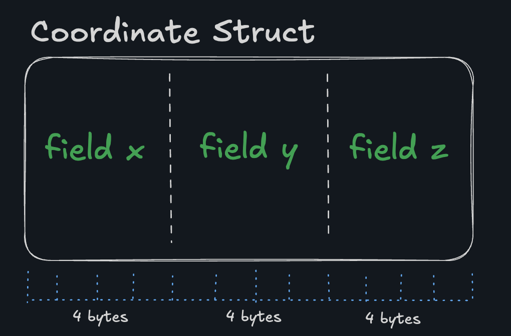
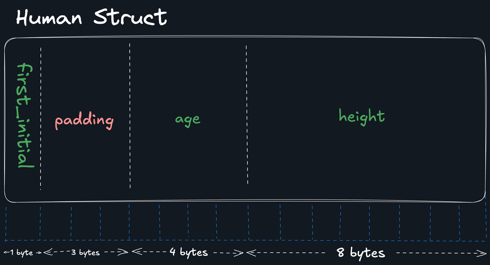

# [sizeof](https://en.cppreference.com/w/c/language/sizeof.html)
Queries size of the object or type.

Used when actual size of the object must be known.
return a value of type [size_t](https://en.cppreference.com/w/c/types/size_t.html).

[data types](https://en.wikipedia.org/wiki/C_data_types)

```c
printf("sizeof(float)          = %zu\n", sizeof(float));
printf("sizeof(void(*)(void))  = %zu\n", sizeof(void(*)(void)));
printf("sizeof(char[10])       = %zu\n", sizeof(char[10]));
```

```c
typedef struct Coordinate {
  int x;
  int y;
  int z;
} coordinate_t;

printf("Size of coordinate_t: %zu bytes\n", sizeof(coordinate_t));
```


Mixed Type Structs
```c
typedef struct Human{
    char first_initial;
    int age;
    double height;
} human_t;

```


CPUs don't like accessing data that isn't aligned (incredible oversimplification alert, since obviously CPUs don't have feelings (yet)), so C inserts padding to maintain alignment (e.g. every 4 bytes in this example).

Huge caveat: these layouts can vary depending on the compiler and system architecture.

As a rule of thumb, ordering your fields from largest to smallest will help the compiler minimize padding:

```c
typedef struct {
  char a;
  double b;
  char c;
  char d;
  long e;
  char f;
} poorly_aligned_t;

typedef struct {
  double b;
  long e;
  char a;
  char c;
  char d;
  char f;
} better_t;
```
