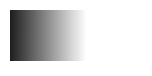
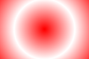

# Gradients

## CreateLinearGradient
Метод `createLinearGradient()` создает объект линейного градиента.

Градиент может использоваться для заливки прямоугольников, окружностей, линий, текста и т.д.

Созданный объект линейного градиента используется в качестве значения свойства `strokeStyle` или `fillStyle`. Для определения различных цветов и их расположения в градиенте используется метод `addColorStop()`.

```js
ctx.createLinearGradient(x0, y0, x1, y1);
```

### Примеры

```js
const grd = ctx.createLinearGradient(0, 0, 170, 0);
grd.addColorStop(0, 'black');
grd.addColorStop(1, 'white');

ctx.fillStyle = grd;
ctx.fillRect(20,20, 150, 100);
```


## CreateRadialGradient
Метод `createRadialGradient()` создает объект радиального/кругового градиента.

Градиент может использоваться для заливки прямоугольников, окружностей, линий, текста и т.д.

Примечание: Созданный объект линейного градиента используется в качестве значения свойства `strokeStyle` или `fillStyle`. Для определения различных цветов и их расположения в градиенте используется метод `addColorStop()`.

```js
ctx.createRadialGradient(x0, y0, r0, x1, y1, r1);
```

### Примеры
```js
const grd = ctx.createRadialGradient(75, 50, 5, 90, 60, 100);
grd.addColorStop(0, 'red');
grd.addColorStop(1, 'white');

// Заполнить фигуру градиентом
ctx.fillStyle = grd;
ctx.fillRect(10, 10, 150, 100);
```

