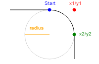

# Arcs

Круг рисуется из двух полукругов методом `arc`.
```js
ctx.arc(xPosition, yPosition, radius, startAngle, endAngle);
```

## Arc

### Примеры

С заливкой:
```js
ctx.fillStyle = '#fff';
ctx.beginPath();
ctx.arc(0, 0, 50, 0, Math.PI * 2);
ctx.closePath();
ctx.fill();
```

Без заливки с обводкой:
```js
ctx.strokeStyle = 'red';
ctx.lineWidth = 5;
ctx.beginPath();
ctx.arc(0, 0, 50, 0, Math.PI * 2);
ctx.closePath();
ctx.stroke();
```

## ArcTo

```js
arcTo(x1, y1, x2, y2, radius);
```

### Примеры
```js
ctx.lineWidth = 5;
ctx.strokeStyle = '#fff';
ctx.beginPath();
ctx.moveTo(100, 20);
ctx.arcTo(150, 20, 150, 70, 50);
ctx.stroke();
```
