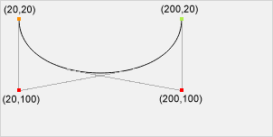

# Line

## Свойства линий
```js
ctx.lineCap = 'butt' || 'round' || 'square';
ctx.lineJoin = 'bevel' || 'round' || 'miter';
ctx.lineDashOffset = number;
ctx.lineWidth = number;
ctx.lineDashOffset = number;
ctx.setLineDash(string[]);
```

## LineTo
```js
ctx.lineTo(x, y);
```

### Примеры

Рисование dashed линий
```js
ctx.beginPath();
ctx.setLineDash([5, 15]);
ctx.moveTo(0, 50);
ctx.lineTo(300, 50);
ctx.stroke();
```

## BezierCurveTo
Для кубической кривой Безье требуется три точки. Первые две точки - контрольные. Они используются для вычислении кривой Безье. Третья точка - конечная точка кривой. Начальная точка кривой Безье - последняя точка текущего контура. Если контур еще не задан, то следует использовать методы beginPath() и moveTo(), чтобы определить начальную точку.

```js
ctx.bezierCurveTo(cp1x, cp1y, cp2x, cp2y, x, y);
```

### Примеры
```js
ctx.beginPath();
ctx.moveTo(20,20);
ctx.bezierCurveTo(20,100,200,100,200,20);
ctx.stroke();
```


## QuadraticCurveTo
Для квадратичной кривой Безье требуется две точки. Первая точка - контрольная. Она используются для вычисления кривой Безье. Вторая точка - конечная точка кривой. Начальная точка кривой Безье - последняя точка текущего контура. Если контур еще не задан, то следует использовать методы beginPath() и moveTo(), чтобы определить начальную точку.

```js
ctx.quadraticCurveTo(cpx, cpy, x, y);
```

### Примеры

```js
ctx.beginPath();
ctx.moveTo(20,20);
ctx.quadraticCurveTo(20,100,200,20);
ctx.stroke();
```

